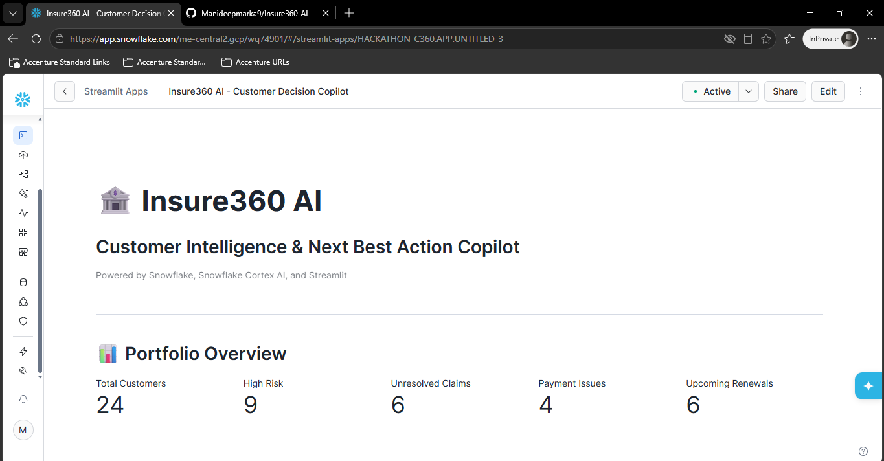
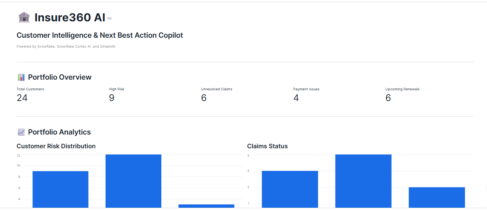
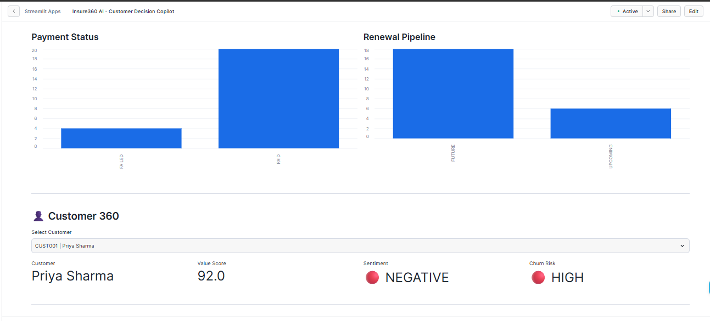
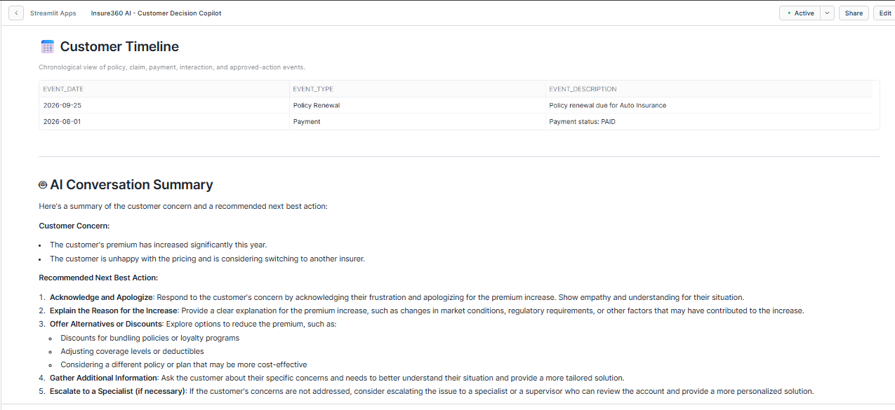
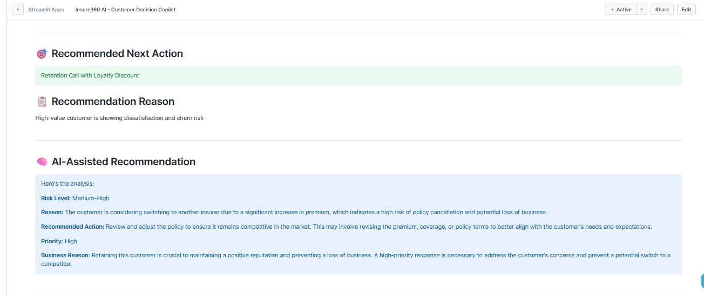
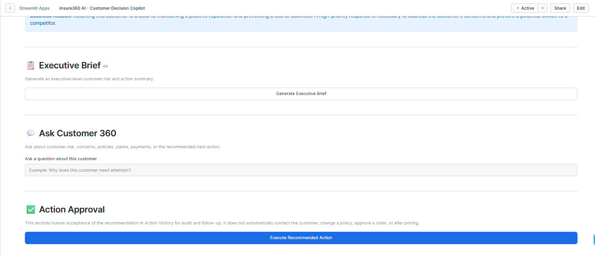
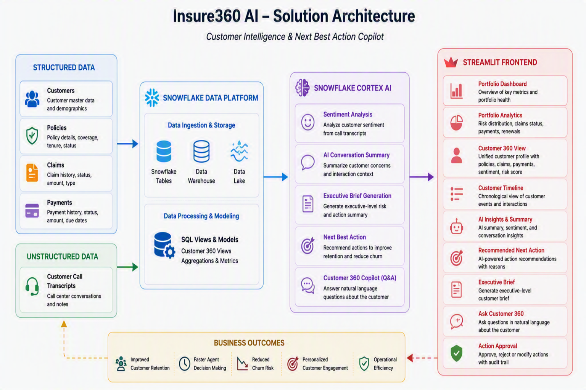

# 🏦 Insure360 AI

Customer Intelligence & Next Best Action Copilot powered by Snowflake Cortex AI.

## 🚀 Overview

Insure360 AI is an AI-powered Customer 360 platform that combines structured and unstructured insurance data to provide actionable customer insights.

The solution helps insurance agents:

- Understand customer health
- Analyze customer sentiment
- Review claims and payment history
- Receive AI-generated customer summaries
- Get Next Best Action recommendations

---

## 🎯 Business Problem

Insurance customer information is often spread across multiple systems, making it difficult for agents to quickly understand customer status and make informed decisions.

Insure360 AI centralizes customer intelligence into a single AI-powered dashboard.

---

## 🏗️ Solution Architecture

### Structured Data
- Customers
- Policies
- Claims
- Payments

### Unstructured Data
- Customer Call Transcripts

### AI Layer
- Snowflake Cortex AI
- Sentiment Analysis
- AI Conversation Summary
- Executive Brief Generation
- Next Best Action Recommendation

### Frontend
- Streamlit in Snowflake

---

## ✨ Key Features

### 📊 Portfolio Dashboard
View customer portfolio metrics including risk, payment issues, unresolved claims, and upcoming renewals.

### 📈 Portfolio Analytics
Visual insights into customer risk distribution, claim status, payment status, and renewal pipeline.

### 👤 Customer 360
Unified customer profile with sentiment, risk indicators, policy information, claims, and payment details.

### 🤖 AI Conversation Summary
Generates customer concern summaries and recommended actions using AI.

### 🎯 Next Best Action
Provides AI-powered recommendations to improve retention and customer satisfaction.

### 📋 Executive Brief
Creates executive-level summaries for decision makers.

### 💬 Ask Customer 360
Natural language interface to ask questions about a customer.

### ✅ Action Approval Workflow
Captures approval of recommended actions for auditability and follow-up.

---

## 🛠️ Technology Stack

- Snowflake
- Snowflake Cortex AI
- Streamlit
- SQL

---

## 📸 Screenshots

### Home Dashboard

### Portfolio Analytics

### Customer 360

### Customer Timeline & AI Summary

### Next Best Action

### Executive Brief & Action Approval

## 🏗️ Solution Architecture

---

## 🌟 Business Benefits

- Improved customer retention
- Faster agent decision making
- Reduced churn risk
- Unified customer intelligence
- AI-assisted customer engagement
- Better operational efficiency

---

## 👨‍💻 Author

Manideep Marka

Built for Snowflake CoCo CLI Hackathon.
